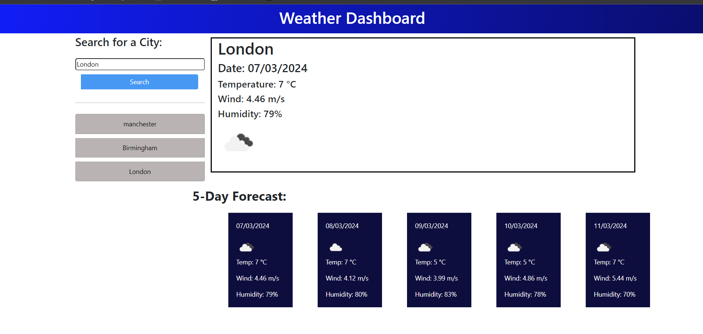

# Module 8 WeatherDashboard

As part of Module 8 of the EDX Front-end web development Bootcamp we were presented with the following criteria:

## User Story

As a Traveler, I want to be able to see the weather outlook for multiple cities, so that I can plan my trip accordingly.

## Acceptance Criteria

* Create a weather dashboard with form inputs.
  * When a user searches for a city they are presented with current and future conditions for that city and that city is added to the search history
  * When a user views the current weather conditions for that city they are presented with:
    * The city name
    * The date
    * An icon representation of weather conditions
    * The temperature
    * The humidity
    * The wind speed
  * When a user view future weather conditions for that city they are presented with a 5-day forecast that displays:
    * The date
    * An icon representation of weather conditions
    * The temperature
    * The humidity
  * When a user click on a city in the search history they are again presented with current and future conditions for that city

## Technology used

  * Uses the OpenWeather API to retrieve weather data.

  * Uses `localStorage` to store persistent data.

# Comments

I Struggled somewhat with the Bootstrap layout a bit due to information overload due to the pace of the course, I will come back to this one to refine it, It looks ok on my screen and phone. I also thought it may be handy to have a clear search function that would essentially clear the local storage but didnt due to time contraints.

The following is a screenshot of the App in use:

